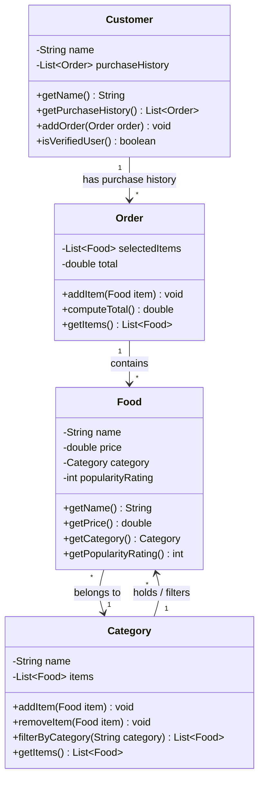

Client Feature Request

We need to build the backend logic for the ByteBites app. The system needs to manage our customers, tracking their names and their past purchase history so the system can verify they are real users.

These customers need to browse specific food items (like a "Spicy Burger" or "Large Soda"), so we must track the name, price, category, and popularity rating for every item we sell.

We also need a way to manage the full collection of items — a digital list that holds all items and lets us filter by category such as "Drinks" or "Desserts".

Finally, when a user picks items, we need to group them into a single transaction. This transaction object should store the selected items and compute the total cost.

Candidate Classes: 
- Customer Class
  - Attributes:
    -
  - Methods: 
    - 
- Food Class
  - Attributes: 
    - Food Popularity
  Methods: 
   -

- Category Class
  - Attributes:
    - 
  - Methods:
    - 
- Order Class
  - Attributes:
    - 
  - Methods:
    - 

